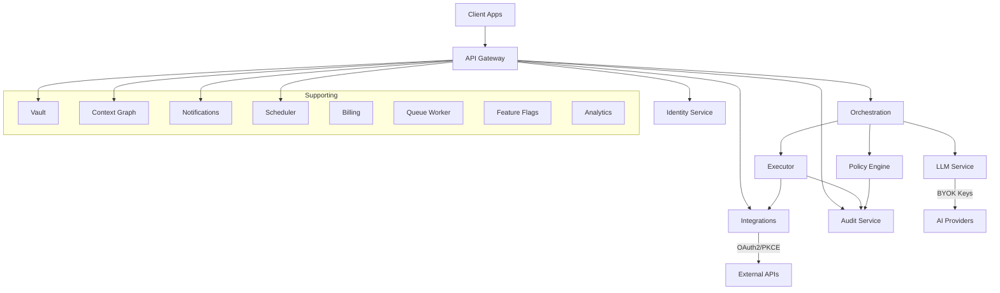
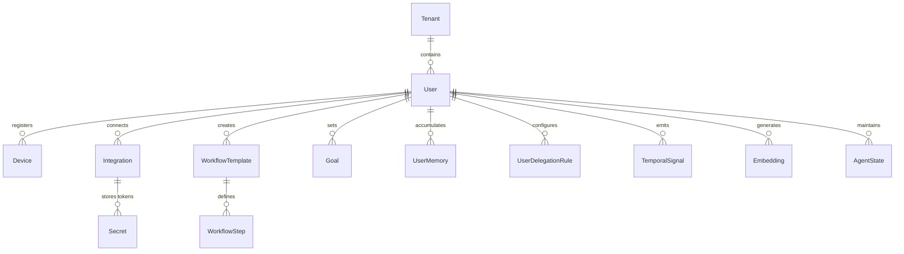

# LyfPilot — Architecture

> Deep dive into the system design of a cloud-based Personal Operating System

---

## Table of Contents

- [System Overview](#system-overview)
- [Design Principles](#design-principles)
- [Service Architecture](#service-architecture)
- [Request Flow](#request-flow)
- [Frontend Architecture](#frontend-architecture)
- [Backend Services](#backend-services)
- [Data Architecture](#data-architecture)
- [Real-Time Communication](#real-time-communication)
- [AI Pipeline](#ai-pipeline)
- [Security Architecture](#security-architecture)

---

## System Overview

LyfPilot follows a **service-oriented architecture** within a **Turborepo monorepo**. Sixteen independent NestJS microservices handle distinct domains, coordinated through a central API Gateway. The architecture enforces a strict principle:

> **LLM proposes → Policy decides → Executor acts**

No AI-generated action ever executes directly. Every proposal passes through a deterministic policy engine before reaching the executor.

```
┌──────────────────────────────────────────────────────────────────┐
│                      Monorepo Structure                          │
├──────────────────────────────────────────────────────────────────┤
│                                                                  │
│  apps/                          services/                        │
│  ├── dashboard     (Next.js)    ├── api-gateway                  │
│  ├── admin         (Next.js)    ├── identity                     │
│  ├── mobile        (RN/Expo)    ├── orchestration                │
│  └── glasses       (WebXR)      ├── llm                          │
│                                  ├── policy                       │
│  shared/                         ├── executor                     │
│  ├── contracts     (Zod)         ├── integrations                 │
│  ├── types         (TS)          ├── context-graph                │
│  ├── utils                       ├── audit                        │
│  ├── logging                     ├── billing                      │
│  ├── observability               ├── scheduler                    │
│  ├── testing                     ├── queue-worker                 │
│  └── theme         (Tamagui)     ├── notifications                │
│                                  ├── vault                        │
│                                  ├── analytics                    │
│                                  └── feature-flags                │
└──────────────────────────────────────────────────────────────────┘
```

---

## Design Principles

| Principle | Implementation |
|-----------|---------------|
| **Contract-First** | Zod schemas in `shared/contracts/` are the canonical source of truth for all API shapes |
| **Defense in Depth** | Seven security layers from network to tenant isolation |
| **Event-Driven** | Async workflows via BullMQ queues and EventEmitter patterns |
| **Multi-Tenant** | Hard isolation at database (RLS), cache (namespace), and audit levels |
| **Observable** | Correlation IDs propagate through every service via AsyncLocalStorage |
| **BYOK** | Users control their own AI provider keys — no vendor lock-in |

---

## Service Architecture

### Core Services



### Service Responsibilities

| Service | Responsibility | Key Tech |
|---------|---------------|----------|
| **API Gateway** | HTTP/WS entry, auth validation, rate limiting, routing | NestJS, Socket.IO, BullMQ |
| **Identity** | Auth, sessions, MFA, passkeys, device management | Prisma, Zod, WebAuthn |
| **Orchestration** | Intent parsing → plan generation → execution coordination | State machine, EventEmitter |
| **LLM** | BYOK key management, model routing, prompt templates | Provider SDKs |
| **Policy** | Deterministic rule evaluation, capability checks, autonomy limits | Rules engine |
| **Executor** | Sandboxed action execution with idempotency guarantees | Isolated VM context |
| **Integrations** | OAuth flows, token management, webhook handling | OAuth2-PKCE, provider adapters |
| **Context Graph** | User knowledge aggregation, semantic search | pgvector (1536-dim) |
| **Audit** | Append-only event trail with correlation IDs | Event sourcing |
| **Vault** | Encrypted secret storage with key rotation | TweetNaCl.js, AES-GCM |
| **Notifications** | Push, email, and in-app notification delivery | Notifee, SMTP |
| **Scheduler** | CRON-based and time-triggered task automation | node-cron |
| **Queue Worker** | Background async job execution | BullMQ |
| **Billing** | Stripe integration with usage metering | Stripe SDK |
| **Analytics** | Usage metrics aggregation and insights | Aggregation pipelines |
| **Feature Flags** | Gradual rollout and A/B testing | Rule engine |

---

## Request Flow

### User Intent → Execution

```
User: "Schedule a meeting with Sarah next Tuesday at 2pm"
  │
  ▼
┌─────────────────────────────────────────────────┐
│ 1. API Gateway                                   │
│    • Authenticate request (JWT/session)           │
│    • Validate payload (Zod schema)                │
│    • Rate limit check                             │
│    • Assign correlation ID                        │
└─────────────┬───────────────────────────────────┘
              │
              ▼
┌─────────────────────────────────────────────────┐
│ 2. Orchestration Service                         │
│    • Parse intent via LLM Service                │
│    • Generate execution plan                     │
│    • Identify required capabilities              │
│    └─→ Plan: {                                   │
│          action: "create_calendar_event",        │
│          provider: "google_calendar",            │
│          params: { ... }                         │
│        }                                         │
└─────────────┬───────────────────────────────────┘
              │
              ▼
┌─────────────────────────────────────────────────┐
│ 3. Policy Engine                                 │
│    • Check user capabilities for calendar access │
│    • Evaluate autonomy constraints               │
│    • Verify time-of-day/amount restrictions      │
│    • Decision: APPROVE / DENY / ESCALATE         │
└─────────────┬───────────────────────────────────┘
              │ (if approved)
              ▼
┌─────────────────────────────────────────────────┐
│ 4. Executor Service                              │
│    • Execute in sandbox                          │
│    • Idempotency key prevents duplicate          │
│    • Call Integration Service                    │
│    └─→ Google Calendar API: create event         │
└─────────────┬───────────────────────────────────┘
              │
              ▼
┌─────────────────────────────────────────────────┐
│ 5. Audit Service                                 │
│    • Log: intent, plan, policy decision,         │
│      execution result, correlation ID            │
│    • Append-only, immutable                      │
└─────────────────────────────────────────────────┘
```

---

## Frontend Architecture

### Web Dashboard (Next.js 14)

```
dashboard/
├── app/                    # App Router (Server + Client Components)
│   ├── (auth)/            # Auth-gated routes
│   ├── (dashboard)/       # Main dashboard layout
│   ├── api/               # API routes (BFF pattern)
│   └── layout.tsx         # Root layout with providers
├── components/
│   ├── ui/                # Tamagui design system primitives
│   ├── features/          # Feature-specific components
│   └── layouts/           # Page layout shells
├── hooks/                 # Custom React hooks
├── lib/                   # Utilities, API clients
└── stores/                # Client state (React Query + SWR)
```

### Mobile App (React Native + Expo)

```
mobile/
├── app/                   # Expo Router (file-based routing)
├── components/            # Shared Tamagui components
├── screens/               # Tab screens (Home, Tasks, Settings)
├── services/              # API client, socket connection
└── stores/                # Local state
```

**Native capabilities:**
- Biometric auth (Face ID / fingerprint) via expo-local-authentication
- Secure token storage via expo-secure-store
- Push notifications via Firebase Messaging + Notifee
- Real-time sync via Socket.IO client

### Shared Design System (Tamagui)

All platforms share a unified design token system:
- Color palettes, spacing, typography, and animation presets
- Components adapt to platform (web shadows → mobile elevation)
- Single source in `shared/theme/`

---

## Data Architecture

### Database: PostgreSQL 14+ with pgvector



**Key design decisions:**
- **Row-Level Security (RLS)** via Prisma for tenant isolation
- **pgvector** extension for semantic embeddings (1536-dim vectors)
- **Append-only audit tables** for compliance (no UPDATE/DELETE)
- **Encrypted secret storage** in vault table (AES-GCM)

### Cache: Redis 7+

- Session data with device binding
- Rate limit counters (sliding window)
- Distributed locks for concurrent operations
- Tenant-namespaced keys for isolation

---

## Real-Time Communication

### WebSocket Architecture (Socket.IO)

```
┌──────────────┐     ┌──────────────────────┐
│   Clients    │ ←──→│   Socket.IO Gateway  │
│ (Web/Mobile) │     │                      │
└──────────────┘     │  Namespaces:         │
                     │  /auth               │
                     │  /runs               │
                     │  /integrations       │
                     │  /notifications      │
                     └──────────┬───────────┘
                                │
                     ┌──────────┴───────────┐
                     │  Event Processing    │
                     │  • Zod validation    │
                     │  • ACK + timeout     │
                     │  • Replay on reconn  │
                     └──────────────────────┘
```

**Key events:**
- `run:started` / `run:step-completed` / `run:policy-decision:requested`
- `notification:received`
- `integration:token-expired`
- `sync:*` (real-time data updates across devices)

---

## AI Pipeline

### BYOK Model Routing

```
User Request
    │
    ▼
┌────────────────────────────┐
│       LLM Service          │
│                            │
│  1. Resolve user's BYOK    │
│     key for provider       │
│  2. Select model based on: │
│     • Task complexity      │
│     • Cost preference      │
│     • Latency requirement  │
│  3. Format prompt with     │
│     context from Context   │
│     Graph                  │
│  4. Call provider API      │
│  5. Parse & validate       │
│     response               │
└────────────┬───────────────┘
             │
             ▼
      Structured Output
      (intent, plan, params)
             │
             ▼
      Policy Engine Check
```

**Supported providers:**
- OpenAI (GPT-4, GPT-4o, GPT-3.5)
- Anthropic (Claude 3 family)
- Google (Gemini)
- Azure OpenAI
- Extensible adapter pattern for new providers

---

## Security Architecture

> See [SECURITY.md](SECURITY.md) for the complete security deep-dive.

**Seven-layer defense model:**

1. **Network** — TLS 1.3 + WAF + rate limiting
2. **Authentication** — Passwordless + MFA + device binding
3. **Authorization** — Capability-based access control (CBAC)
4. **AI Gating** — Deterministic policy engine (non-LLM)
5. **Encryption** — AES-GCM (rest), TLS (transit), Argon2id (hashing)
6. **Audit** — Immutable, append-only event trail
7. **Isolation** — Hard multi-tenant partitioning

---

*This document describes the architectural design of LyfPilot. The source code is proprietary and not publicly available.*

**© 2024-2026 DevStudio AI Inc.. All rights reserved.**
